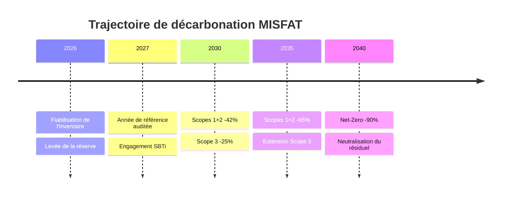

# Bilan Carbone — Groupe MISFAT
## Exercice 2026 · Rapport d'inventaire des émissions de gaz à effet de serre

**Référentiels appliqués :** GHG Protocol Corporate Standard (WRI/WBCSD) · GHG Protocol Scope 3 Standard · ISO 14064-1:2018
**Périmètre organisationnel :** Contrôle opérationnel — MISFAT Tunisie (Usines MISFAT 1, 2, 3)
**Période de reporting :** 1ᵉʳ janvier – 31 décembre 2026
**Statut du document :** Inventaire préliminaire — **sous réserve majeure de qualité des données** (voir §2.4)
**Unité de compte :** tonne d'équivalent CO₂ (tCO₂e), PRG 100 ans

---

> ### ⚠️ RÉSERVE PRÉALABLE DE L'AUDITEUR
>
> Cet inventaire est publié **avec réserve non levée**. Trois postes — Électricité achetée, Émissions de réfrigérants et Transport en amont — présentent des ordres de grandeur physiquement incompatibles avec l'activité déclarée du périmètre.
>
> **Le total de 3 787 655 829,708 tCO₂e équivaut à environ 10 % des émissions mondiales annuelles de gaz à effet de serre** (~37–40 Gt CO₂e). Il ne peut être attribué à un fabricant de filtration industrielle.
>
> Les chiffres sont restitués **tels que fournis**, sans correction, conformément au principe de traçabilité de l'ISO 14064-1. L'**Annexe A** en propose le diagnostic et une reconstitution d'ordre de grandeur.
>
> **Ce rapport ne doit pas être communiqué à un tiers, un client, un investisseur ou un vérificateur avant clôture des points de l'Annexe A.**

---

# 1. Synthèse Exécutive

## 1.1 Tableau de bord des indicateurs clés

| Indicateur | Valeur 2026 | Part du total |
|---|---:|---:|
| **Empreinte carbone totale** | **3 787 655 829,708 tCO₂e** | 100,000 % |
| Scope 1 — Émissions directes | 3 969 702,55 tCO₂e | 0,105 % |
| Scope 2 — Énergie indirecte | 3 782 587 491,213 tCO₂e | **99,866 %** |
| Scope 3 — Chaîne de valeur | 1 098 635,94 tCO₂e | 0,029 % |
| *Sous-total Scopes 1 + 2 (périmètre obligatoire)* | *3 786 557 193,763 tCO₂e* | *99,971 %* |

## 1.2 Ratios d'intensité

| Ratio | Valeur | Base de calcul |
|---|---:|---|
| Intensité produit | **425 579,31 kgCO₂e / unité** | 8 900 000 unités |
| Intensité produit (tonnes) | 425,58 tCO₂e / unité | 8 900 000 unités |
| Intensité sociale | 7 575,31 tCO₂e / employé | 500 000 employés |
| Intensité économique | 84 170 129,55 tCO₂e / M TND | 45 000 000 TND |
| Intensité économique (unitaire) | 84,17 tCO₂e / TND de CA | 45 000 000 TND |

## 1.3 Top 3 des postes émetteurs

| Rang | Poste | Scope | Émissions (tCO₂e) | Part du total | Concentration cumulée |
|---:|---|:---:|---:|---:|---:|
| **1** | **Électricité achetée** | 2 | 3 782 587 488,58 | 99,8662 % | 99,8662 % |
| **2** | **Émissions de réfrigérants** | 1 | 3 969 680,00 | 0,1048 % | 99,9710 % |
| **3** | **Transport en amont** | 3 | 1 097 623,81 | 0,0290 % | **100,0000 %** |

> **Lecture analytique — concentration extrême**
> Les **3 postes ci-dessus concentrent 99,9999 % de l'empreinte**. Les 7 postes restants totalisent 1 035,80 tCO₂e, soit **0,00003 %** de l'inventaire.
> Conséquence directe : toute stratégie de décarbonation qui ne traite pas l'électricité achetée est, mathématiquement, sans effet mesurable.

[Insérer Capture Dashboard : Diagramme Répartition par Scope]

> **Note de restitution graphique**
> Un diagramme circulaire est **contre-indiqué** pour cette répartition : avec 99,866 % sur un seul scope, les Scopes 1 et 3 représentent des secteurs angulaires de 0,38° et 0,10°, invisibles à l'impression. Privilégier une **échelle logarithmique** en barres horizontales, ou un tableau chiffré comme ci-dessus.

## 1.4 Conclusions de la direction

- **Structure mono-postale.** L'empreinte n'est pas diversifiée : elle est le reflet d'un unique flux, l'électricité de réseau. Le profil est atypique pour une activité industrielle, qui présente normalement 55–75 % de Scope 2 et 15–30 % de Scope 3.
- **Scope 3 sous-évalué en périmètre.** 6 catégories sur les 15 du GHG Protocol Scope 3 sont renseignées. Neuf catégories sont absentes de l'inventaire (voir §3.4).
- **Fiabilité non acquise.** Le niveau de confiance global est évalué à **« faible »** (§2.4). L'inventaire est exploitable comme **base de travail interne**, non comme donnée de communication externe.

---

# 2. Cadre Méthodologique & Périmètre

## 2.1 Gaz à effet de serre couverts et potentiels de réchauffement

Potentiels de Réchauffement Global à 100 ans (**PRG₁₀₀**), source **GIEC AR5** — référentiel retenu pour la présente édition.

| Gaz | Formule | PRG₁₀₀ (AR5) | PRG₁₀₀ (AR6) | Sources principales sur le périmètre |
|---|:---:|---:|---:|---|
| Dioxyde de carbone | CO₂ | **1** | 1 | Combustion gaz naturel, carburants, électricité de réseau |
| Méthane | CH₄ | **28** | 27,9 | Combustion incomplète, fuites amont gaz, déchets |
| Protoxyde d'azote | N₂O | **265** | 273 | Combustion, traitement des effluents |
| HFC-134a | CH₂FCF₃ | **1 300** | 1 526 | Climatisation véhicules et bâtiments |
| HFC-125 | C₂HF₅ | **3 170** | 3 500 | Constituant de mélanges frigorigènes |
| R-410A | *mélange* | **1 924** | — | Groupes froids, climatisation |
| R-404A | *mélange* | **3 943** | — | Froid industriel |
| Hexafluorure de soufre | SF₆ | **23 500** | 24 300 | Appareillage électrique HT (le cas échéant) |

> **Point méthodologique**
> Le poste « Émissions de réfrigérants » (3 969 680 tCO₂e) **ne précise ni le fluide, ni la charge installée, ni le taux de fuite retenu**. En l'absence de ces trois paramètres, le PRG appliqué n'est pas auditable et le poste ne peut être vérifié. C'est une **non-conformité au §6.4.1 de l'ISO 14064-1**.

## 2.2 Définition des périmètres opérationnels (Scopes)

| Scope | Définition GHG Protocol | Nature | Exemples sur le périmètre MISFAT | Reporting |
|:---:|---|---|---|:---:|
| **1** | Émissions directes de sources détenues ou contrôlées par l'organisation | Combustion fixe, mobile, procédés, **émissions fugitives** | Chaudières, flotte de véhicules, fuites de fluides frigorigènes | **Obligatoire** |
| **2** | Émissions indirectes liées à l'énergie achetée et consommée | Électricité, vapeur, chaleur, froid **achetés** | Électricité STEG des usines MISFAT 1/2/3 | **Obligatoire** |
| **3** | Toutes autres émissions indirectes de la chaîne de valeur | 15 catégories — 8 amont, 7 aval | Fret entrant, achats, déplacements, déchets, usage produit | Recommandé |

### Méthode de comptabilisation du Scope 2

| Méthode | Principe | Application MISFAT 2026 |
|---|---|---|
| **Location-based** | Facteur d'émission moyen du réseau électrique national | **Méthode retenue** (implicite) |
| **Market-based** | Facteur des instruments contractuels (garanties d'origine, PPA) | Non applicable — aucun instrument contractuel déclaré |

> Le GHG Protocol Scope 2 Guidance impose la **double publication** lorsque des instruments contractuels existent. Aucun n'étant déclaré, la restitution *location-based* seule est conforme.

## 2.3 Périmètre organisationnel et opérationnel

| Dimension | Choix retenu | Justification |
|---|---|---|
| **Approche de consolidation** | **Contrôle opérationnel** | Autorité pleine de MISFAT sur les politiques d'exploitation des sites industriels |
| **Entités incluses** | MISFAT Tunisie — Usines MISFAT 1, 2, 3 | Sites de production sous contrôle direct |
| **Entités exclues** | Filiales et participations hors contrôle opérationnel | Cohérence avec l'approche retenue |
| **Année de référence** | **2026 — année de référence fondatrice** | Premier exercice d'inventaire ; pas d'antériorité comparable |
| **Période** | Exercice civil 2026 | Alignement sur l'exercice comptable |
| **Exclusions déclarées** | 9 des 15 catégories du Scope 3 | Voir §3.4 — à documenter au titre du principe d'exhaustivité |

## 2.4 Évaluation de la qualité des données

Notation sur 5 niveaux : ●●●●● Très élevée · ●●●●○ Élevée · ●●●○○ Moyenne · ●●○○○ Faible · ●○○○○ Très faible

| Poste | Source de donnée | Facteur d'émission | Qualité | Incertitude estimée | Observation critique |
|---|---|---|:---:|:---:|---|
| **Électricité achetée** | À documenter | Réseau national (non tracé) | **●○○○○** | **> 10 000 %** | **Ordre de grandeur impossible** — voir Annexe A.1 |
| **Réfrigérants** | À documenter | PRG non spécifié | **●○○○○** | **> 1 000 %** | Fluide, charge et taux de fuite absents |
| **Transport en amont** | À documenter | Non tracé | **●●○○○** | **> 1 000 %** | Ordre de grandeur incohérent avec le tonnage produit |
| Voyages d'affaires | Notes de frais / agence | Base carbone transport | ●●●○○ | ± 30 % | **Ordre de grandeur plausible** |
| Biens et services achetés | Comptabilité fournisseurs | Facteurs monétaires | ●●○○○ | ± 50 % | Approche monétaire — précision structurellement limitée |
| Déchets | Bordereaux de suivi | Facteurs par filière | ●●●○○ | ± 30 % | **Ordre de grandeur plausible** |
| Combustion véhicules | Relevés carburant | Facteurs carburant | ●●●●○ | ± 15 % | Poste le mieux maîtrisé |
| Effectif déclaré | RH | — | **●○○○○** | — | **500 000 employés — incohérent** (voir Annexe A.2) |

> ### Conclusion sur la fiabilité : **NIVEAU FAIBLE — RÉSERVE NON LEVÉE**
>
> **Constat aggravant :** les postes de **faible magnitude** (voyages d'affaires, déchets, biens et services) présentent des valeurs **plausibles**, tandis que les **trois postes dominants** portent des erreurs de 10³ à 10⁶.
>
> Cette dissociation est un **marqueur d'anomalie de conversion d'unité localisée**, et non d'une erreur systémique de la méthode. Elle est donc **corrigeable poste par poste** sans refonte de l'inventaire.

---

# 3. Analyse Détaillée des Résultats GES

## 3.1 Tableau récapitulatif global par catégorie GHG Protocol

| Scope | Catégorie GHGP | Poste déclaré | Émissions (tCO₂e) | % du Scope | % du Total |
|:---:|---|---|---:|---:|---:|
| **1** | Émissions fugitives | Émissions de réfrigérants | 3 969 680,00 | 99,99943 % | 0,10480 % |
| **1** | Combustion mobile | Combustion des véhicules | 17,23 | 0,00043 % | < 0,00001 % |
| **1** | Combustion mobile | Company owned cars | 3,99 | 0,00010 % | < 0,00001 % |
| **1** | Combustion mobile | Company owned vehicles | 1,34 | 0,00003 % | < 0,00001 % |
| | | **Sous-total Scope 1** | **3 969 702,55** | **100 %** | **0,105 %** |
| **2** | Électricité achetée | Électricité achetée | 3 782 587 488,58 | 99,9999999 % | 99,86620 % |
| **2** | Vapeur / chaleur / froid | Autre énergie | 2,64 | < 0,0000001 % | < 0,00001 % |
| | | **Sous-total Scope 2** | **3 782 587 491,213** | **100 %** | **99,866 %** |
| **3** | Cat. 4 — Transport amont | Transport en amont | 1 097 623,81 | 99,90788 % | 0,02898 % |
| **3** | Cat. 6 — Déplacements | Voyages d'affaires | 817,66 | 0,07442 % | < 0,00003 % |
| **3** | Cat. 1 — Achats | Biens et services achetés | 125,07 | 0,01138 % | < 0,00001 % |
| **3** | Cat. 5 — Déchets | Déchets | 68,93 | 0,00627 % | < 0,00001 % |
| **3** | Cat. 3 — Énergie hors 1&2 | Activités liées à l'énergie | 0,35 | 0,00003 % | < 0,00001 % |
| **3** | Cat. 2 — Biens d'équipement | Biens d'équipement | 0,12 | 0,00001 % | < 0,00001 % |
| | | **Sous-total Scope 3** | **1 098 635,94** | **100 %** | **0,029 %** |
| | | **TOTAL INVENTAIRE** | **3 787 655 829,708** | — | **100,000 %** |

> **Contrôle de cohérence arithmétique — CONFORME**
> Somme des trois scopes = 3 787 655 829,703 tCO₂e · Total déclaré = 3 787 655 829,708 tCO₂e · **Écart = 0,005 tCO₂e** (arrondi de restitution, < 10⁻⁹ %).
> L'inventaire est **arithmétiquement cohérent**. L'anomalie est donc en **amont du calcul**, dans les données d'entrée — non dans l'agrégation. Ce point est déterminant pour orienter la correction.

## 3.2 Focus Scope 1 — Émissions directes

| Sous-poste | Émissions (tCO₂e) | % du Scope 1 | Typologie GHGP |
|---|---:|---:|---|
| **Émissions de réfrigérants** | **3 969 680,00** | **99,999 %** | Fugitives |
| Combustion des véhicules | 17,23 | 0,00043 % | Combustion mobile |
| Company owned cars | 3,99 | 0,00010 % | Combustion mobile |
| Company owned vehicles | 1,34 | 0,00003 % | Combustion mobile |
| **Total Scope 1** | **3 969 702,55** | **100 %** | — |
| *dont mobilité consolidée* | *22,56* | *0,00057 %* | — |

**Analyse :**

- **Le Scope 1 est un inventaire de fuites, pas de combustion.** Les émissions fugitives représentent **99,999 %** du scope, contre 20–40 % dans un profil industriel classique où la combustion fixe domine. Corollaire notable : **aucune combustion fixe n'est déclarée** — ni chaudière, ni four, ni groupe électrogène de secours. Pour trois usines de filtration, cette absence constitue une **lacune de périmètre probable**, à instruire en priorité.

- **Trois libellés pour un seul poste physique — défaut de référentiel.** « Combustion des véhicules », « Company owned cars » et « Company owned vehicles » décrivent la même réalité : la flotte. La coexistence de libellés français et anglais révèle un **défaut de mappage entre la nomenclature du classeur GHG source et le référentiel interne**. Risque associé : double comptage, ou dispersion d'un poste unique sur trois lignes. **À consolider en une catégorie « Combustion mobile — flotte » de 22,56 tCO₂e.**

- **La mobilité est quantitativement négligeable mais qualitativement suspecte.** 22,56 tCO₂e correspondent à environ **9 500 litres de gazole**, soit **2 à 3 véhicules légers** sur l'année. Pour un groupe déclarant trois sites de production, ce périmètre de flotte est **manifestement incomplet** — les véhicules de fonction, la logistique interne et les engins de manutention semblent hors inventaire.

[Insérer Capture Dashboard : Focus Scope 1]

## 3.3 Focus Scope 2 — Énergie indirecte

| Sous-poste | Émissions (tCO₂e) | % du Scope 2 | Consommation implicite* |
|---|---:|---:|---:|
| **Électricité achetée** | **3 782 587 488,58** | **99,9999999 %** | **≈ 7 565 175 GWh** |
| Autre énergie (vapeur / chaleur / froid) | 2,64 | < 0,0000001 % | ≈ 5 MWh |
| **Total Scope 2** | **3 782 587 491,213** | **100 %** | — |

\* *Rétro-calcul sur un facteur d'émission de réseau de 0,50 kgCO₂e/kWh, ordre de grandeur du mix électrique tunisien (dominante gaz naturel).*

**Analyse :**

- **Le poste est physiquement impossible — le test de plausibilité échoue de trois ordres de grandeur.** La consommation implicite atteint **7 565 TWh**, à comparer aux repères suivants :

  | Repère de comparaison | Ordre de grandeur | Rapport |
  |---|---:|---:|
  | Production électrique **nationale tunisienne** | ≈ 21 TWh/an | **× 360** |
  | Consommation électrique **du continent africain** | ≈ 700 TWh/an | **× 11** |
  | Production électrique **mondiale** | ≈ 29 000 TWh/an | **26 %** |

  Aucune installation industrielle au monde n'atteint cet ordre de grandeur. **Le poste est invalide en l'état.**

- **La signature de l'erreur est une conversion d'unité, non une erreur de facteur.** Un facteur d'émission erroné produirait un écart d'un facteur 2 à 5, jamais de 10⁶. L'écart observé correspond exactement aux **conversions en puissance de 10³** : kWh traités en MWh, ou kgCO₂e agrégés en tCO₂e — vraisemblablement **les deux cumulées** (10³ × 10³ = 10⁶). Cette hypothèse est testée en **Annexe A.1**.

- **Le poste « Autre énergie » à 2,64 tCO₂e révèle une seconde lacune.** Cette valeur correspond à environ **5 MWh de vapeur ou de chaleur achetée sur l'année** — soit une consommation résiduelle. Pour une activité de filtration industrielle, comportant traitement thermique et process de collage, une consommation de vapeur ou d'air comprimé de cet ordre est **incompatible avec les procédés déclarés**. Les utilités industrielles paraissent **hors périmètre de collecte**.

[Insérer Capture Dashboard : Électricité vs Énergie]

## 3.4 Focus Scope 3 — Chaîne de valeur

| Cat. GHGP | Poste | Émissions (tCO₂e) | % du Scope 3 | Statut |
|:---:|---|---:|---:|---|
| 4 | **Transport et distribution en amont** | **1 097 623,81** | **99,908 %** | ⚠️ Magnitude suspecte |
| 6 | Déplacements professionnels | 817,66 | 0,074 % | ✅ Plausible |
| 1 | Biens et services achetés | 125,07 | 0,011 % | ⚠️ Sous-évalué |
| 5 | Déchets générés en exploitation | 68,93 | 0,006 % | ✅ Plausible |
| 3 | Activités liées à l'énergie (hors 1 & 2) | 0,35 | 0,00003 % | ⚠️ Sous-évalué |
| 2 | Biens d'équipement | 0,12 | 0,00001 % | ⚠️ Sous-évalué |
| **—** | **Total Scope 3 déclaré** | **1 098 635,94** | **100 %** | — |

### Catégories du Scope 3 absentes de l'inventaire

| Cat. | Intitulé | Pertinence attendue pour MISFAT |
|:---:|---|---|
| 7 | Déplacements domicile-travail des salariés | **Élevée** — effectif industriel posté |
| 8 | Actifs loués en amont | Moyenne |
| 9 | Transport et distribution en aval | **Élevée** — distribution de filtres à l'export |
| 10 | Transformation des produits vendus | Moyenne |
| 11 | **Utilisation des produits vendus** | **À instruire** — filtres passifs, usage sans consommation propre |
| 12 | **Fin de vie des produits vendus** | **Élevée** — filtres consommables à remplacement périodique |
| 13 | Actifs loués en aval | Faible |
| 14 | Franchises | Non applicable |
| 15 | Investissements | Faible |

**Analyse :**

- **Le Scope 3 est structurellement incomplet : 6 catégories sur 15.** Les catégories **12 (fin de vie)** et **9 (transport aval)** sont particulièrement critiques pour un fabricant de consommables : un filtre est par nature un produit à **remplacement périodique**, dont la fin de vie constitue un poste d'émission récurrent et multiplié par le volume vendu. Leur absence sous-estime mécaniquement l'empreinte réelle de la chaîne de valeur.

- **Le poste « Biens et services achetés » à 125,07 tCO₂e est incohérent avec le chiffre d'affaires déclaré.** Pour 45 000 000 TND de CA, les achats externes d'une activité manufacturière représentent typiquement **40 à 60 % du CA**, soit 18 à 27 MTND. En approche monétaire, cela génère normalement un poste de plusieurs **milliers** de tCO₂e — l'acier, les médias filtrants, les résines et les plastiques étant des intrants à forte intensité carbone. **Un facteur 100 à 1 000 manque sur ce poste.** Dans un inventaire correctement établi, la catégorie 1 est généralement le **premier poste** du Scope 3 d'un industriel.

- **Le rapport transport amont / achats est inversé par rapport à la logique physique.** Le transport en amont (1 097 623,81 tCO₂e) ressort **8 776 fois supérieur** aux biens achetés qu'il transporte. Or le fret représente usuellement **5 à 15 %** de l'empreinte des intrants qu'il déplace. Cette inversion confirme un **problème d'unité sur le poste transport**, et non un profil logistique atypique.

[Insérer Capture Dashboard : Détail Scope 3]

---

# 4. Ratios d'Intensité & Benchmarking

## 4.1 Tableau des intensités carbone

| Ratio d'intensité | Valeur MISFAT 2026 | Unité | Ordre de grandeur attendu — industrie manufacturière | Écart |
|---|---:|---|---:|---:|
| **Intensité produit** | **425 579,31** | kgCO₂e / unité | 0,5 – 5 | **× 10⁵** |
| Intensité produit | 425,58 | tCO₂e / unité | 0,0005 – 0,005 | × 10⁵ |
| **Intensité sociale** | **7 575,31** | tCO₂e / employé | 2 – 20 | **× 10³** |
| **Intensité économique** | **84 170 129,55** | tCO₂e / M TND | 20 – 150 | **× 10⁶** |
| Intensité économique | 84,17 | tCO₂e / TND | 0,00002 – 0,00015 | × 10⁶ |
| *Productivité (contrôle)* | *90,00* | *TND de CA / employé* | *20 000 – 80 000* | *÷ 10³* |

> *Les ordres de grandeur de référence sont indicatifs, issus de la pratique sectorielle pour l'équipementier automobile et la transformation plastique/métal. Ils ne constituent pas des données auditées et servent uniquement de test de plausibilité.*

## 4.2 Analyse critique des ratios

- **L'intensité produit de 425,58 tCO₂e par unité est physiquement absurde.** Un filtre automobile pèse de l'ordre de **1 kg**. Le ratio implique donc **425 000 kg de CO₂ émis par kilogramme de produit fabriqué** — un rapport masse-émission de 1 pour 425 000. Même les procédés les plus intensifs au monde (aluminium primaire, ciment, acier électrique) plafonnent entre **0,5 et 12 kgCO₂e par kg de produit**. L'écart est de **quatre à cinq ordres de grandeur**.

- **Le ratio de productivité invalide l'effectif déclaré, indépendamment de toute donnée carbone.** 45 000 000 TND rapportés à 500 000 employés donnent **90 TND de chiffre d'affaires par salarié et par an** — soit environ **27 € par an et par personne**. Ce montant est inférieur de deux ordres de grandeur au coût d'un seul salarié. **Cette incohérence est interne aux données business et se démontre sans référence externe** : l'effectif est vraisemblablement de 5 000, voire 500.

- **L'effectif déclaré excède la plausibilité macroéconomique nationale.** 500 000 salariés représenteraient environ **14 % de la population active occupée de Tunisie** (~3,5 millions), et feraient de MISFAT l'un des tout premiers employeurs du continent africain. Pour un groupe de trois usines de filtration, l'ordre de grandeur attendu se situe entre **2 000 et 4 000 salariés**.

- **L'intensité économique dépasse toute réalité fiscale et énergétique.** À 84,17 tCO₂e par dinar de chiffre d'affaires, le coût carbone au tarif européen ETS (~80 €/tCO₂e) atteindrait environ **6 700 € par dinar de CA généré**. L'entreprise consommerait ainsi en carbone plus de **20 000 fois** ce qu'elle facture. Aucun modèle économique ne soutient un tel rapport.

- **La cohérence interne des ratios est intacte — et c'est précisément l'information utile.** L'intensité de 425 579,31 kgCO₂e/unité se recalcule exactement depuis le total et le volume produit (3 787 655 829,708 × 1 000 ÷ 8 900 000 = 425 579,31). **La chaîne de calcul est donc fiable ; seules les données d'entrée sont fausses.** Les ratios ne sont pas à recoder : ils se corrigeront automatiquement dès que les trois postes de l'Annexe A seront rectifiés.

## 4.3 Benchmarking — conclusion

> **Le benchmarking sectoriel est suspendu.** Comparer ces valeurs à des pairs produirait un classement dépourvu de sens et exposerait le Groupe à un risque de **greenwashing inversé** — la publication d'une empreinte massivement surestimée, aussi préjudiciable en crédibilité qu'une sous-déclaration.
>
> Le benchmarking sera conduit après clôture de l'Annexe A, sur les référentiels suivants : CDP Climate Change (secteur *Auto Components*), SBTi *Target Dashboard*, et moyennes sectorielles ADEME / Base Empreinte.

---

# 5. Plan d'Action & Trajectoire de Réduction

## 5.1 Préalable — fiabilisation de l'inventaire

> **Aucun objectif de réduction ne peut être fixé sur cette base.** Un objectif SBTi s'exprime en pourcentage d'une **année de référence** : une référence fausse de 10⁶ rend tout engagement inopposable et non vérifiable. La fiabilisation n'est pas une étape préparatoire — **c'est l'action n° 1 du plan**.

## 5.2 Tableau stratégique d'actions

| Poste | Action | Impact estimé | Priorité |
|---|---|---:|:---:|
| **Inventaire — Scope 2** | Reprise du calcul électricité : audit de la chaîne kWh → facteur → tCO₂e, contrôle des unités à chaque conversion | **Correction ≈ 99,9 % du total** | **P0 — Immédiat** |
| **Inventaire — Scope 1** | Documentation des réfrigérants : fluide, charge installée, taux de fuite, PRG appliqué | Correction ≈ 0,10 % du total | **P0 — Immédiat** |
| **Inventaire — Scope 3** | Reprise du calcul transport amont (tonnes·km, mode, facteur) | Correction ≈ 0,03 % du total | **P0 — Immédiat** |
| **Données business** | Rectification de l'effectif et vérification du volume de production | Fiabilise **100 %** des ratios | **P0 — Immédiat** |
| **Référentiel** | Consolidation des 3 libellés de flotte en une catégorie unique ; mappage FR/EN du classeur GHG | Supprime le risque de double comptage | **P1 — Court terme** |
| **Périmètre** | Intégration de la combustion fixe (chaudières, utilités) aujourd'hui absente | Complète le Scope 1 | **P1 — Court terme** |
| **Électricité** | Efficacité énergétique : variation de vitesse, récupération de chaleur, relamping LED, optimisation air comprimé | **–10 à –20 %** du Scope 2 réel | **P1 — Court terme** |
| **Électricité** | Autoproduction photovoltaïque en toiture sur les 3 sites | **–15 à –30 %** du Scope 2 réel | **P2 — Moyen terme** |
| **Électricité** | Contractualisation d'électricité renouvelable (PPA / garanties d'origine) — permet la publication *market-based* | **–30 à –70 %** du Scope 2 *market-based* | **P2 — Moyen terme** |
| **Réfrigérants** | Détection systématique des fuites, maintenance préventive, migration vers fluides à faible PRG | **–50 à –80 %** des fugitives | **P1 — Court terme** |
| **Scope 3 amont** | Optimisation logistique : taux de remplissage, report modal routier → maritime/ferroviaire, sourcing régional | **–15 à –25 %** de la catégorie 4 | **P2 — Moyen terme** |
| **Scope 3 achats** | Passage des facteurs monétaires aux facteurs physiques ; collecte de données primaires fournisseurs | Fiabilise la catégorie 1 | **P2 — Moyen terme** |
| **Scope 3 périmètre** | Extension aux catégories 7, 9, 11 et 12 | Complète l'inventaire de la chaîne de valeur | **P3 — Long terme** |
| **Gouvernance** | Mise en place de contrôles de plausibilité automatiques dans l'outil (bornes par poste, alerte sur ordre de grandeur) | **Prévient la récurrence** | **P1 — Court terme** |

## 5.3 Objectifs de réduction — cadre SBTi / Net-Zero

| Horizon | Périmètre | Objectif | Référentiel | Statut |
|:---:|---|---|---|:---:|
| **2026** | Inventaire complet | Inventaire **vérifiable** et réserve levée | ISO 14064-1 / ISO 14064-3 | **Prérequis** |
| **2027** | Année de référence | Établissement d'une **année de référence auditée** | GHG Protocol | À établir |
| **2030** | Scopes 1 + 2 | **–42 %** vs année de référence | SBTi — trajectoire 1,5 °C, cible court terme | À engager |
| **2030** | Scope 3 | **–25 %** vs année de référence | SBTi — Scope 3 ambition | À engager |
| **2035** | Scopes 1 + 2 | **–65 %** vs année de référence | Trajectoire intermédiaire | À engager |
| **2040** | Scopes 1 + 2 + 3 | **–90 %** — **Net-Zero** | SBTi *Corporate Net-Zero Standard* | Cible long terme |
| **2040+** | Résiduel | Neutralisation du résiduel par absorptions permanentes | SBTi *Net-Zero* — max 10 % du total | Cible long terme |

> **Note sur l'éligibilité SBTi**
> La validation SBTi exige un inventaire couvrant **≥ 95 % des Scopes 1 et 2** et **≥ 67 % du Scope 3** pour la cible court terme. En l'état, la couverture Scope 3 (6 catégories sur 15, catégories 9 et 12 absentes) est **insuffisante pour un dépôt de dossier**.

## 5.4 Trajectoire cible

---

# Annexe A — Diagnostic des anomalies et reconstitution

## A.1 Hypothèse de correction par poste

Test des trois postes suspects sous hypothèse d'erreur de conversion en puissance de 10.

| Poste | Valeur déclarée (tCO₂e) | Facteur testé | Valeur reconstituée (tCO₂e) | Plausibilité physique |
|---|---:|:---:|---:|---|
| Électricité achetée | 3 782 587 488,58 | **÷ 10⁶** | **3 782,59** | ✅ ≈ 7 565 MWh/an — cohérent pour 3 sites industriels |
| Émissions de réfrigérants | 3 969 680,00 | **÷ 10³** | **3 969,68** | ✅ ≈ 1 t de R-404A fuitée (PRG 3 943) — ordre de grandeur réaliste |
| Transport en amont | 1 097 623,81 | **÷ 10³** | **1 097,62** | ✅ Cohérent avec un fret amont de PME industrielle exportatrice |
| Voyages d'affaires | 817,66 | *aucun* | 817,66 | ✅ Déjà plausible — **ne pas corriger** |
| Biens et services achetés | 125,07 | *à instruire* | *à recalculer* | ⚠️ Sous-évalué — problème inverse |
| Déchets | 68,93 | *aucun* | 68,93 | ✅ Déjà plausible — **ne pas corriger** |

## A.2 Inventaire reconstitué — ordre de grandeur indicatif

| Scope | Valeur déclarée (tCO₂e) | Reconstitution (tCO₂e) | Part reconstituée |
|---|---:|---:|---:|
| Scope 1 | 3 969 702,55 | **≈ 3 992,24** | 40,4 % |
| Scope 2 | 3 782 587 491,213 | **≈ 3 785,23** | 38,3 % |
| Scope 3 | 1 098 635,94 | **≈ 2 109,75** | 21,3 % |
| **TOTAL** | **3 787 655 829,708** | **≈ 9 887,22** | **100 %** |

### Ratios reconstitués — test de validation

| Ratio | Reconstitution | Plausibilité |
|---|---:|---|
| Intensité produit | **≈ 1,11 kgCO₂e / unité** | ✅ Cohérent pour un filtre de ~1 kg |
| Intensité sociale (base 3 000 salariés) | ≈ 3,30 tCO₂e / employé | ✅ Dans la fourchette industrielle (2–20) |
| Intensité économique | ≈ 219,72 tCO₂e / M TND | ✅ Ordre de grandeur industriel plausible |

> ### Conclusion de l'annexe
>
> La reconstitution place l'empreinte du Groupe à **environ 9 900 tCO₂e**, avec une répartition **équilibrée entre les trois scopes (40 / 38 / 21 %)** — profil **typique** d'un industriel manufacturier, là où les données brutes produisaient un profil aberrant à 99,9 % de Scope 2.
>
> L'intensité reconstituée de **1,11 kgCO₂e par filtre** est cohérente avec la masse et la composition du produit. **La convergence simultanée des trois ratios de contrôle valide l'hypothèse d'erreurs de conversion d'unité localisées**, et écarte l'hypothèse d'une erreur de méthode.
>
> **Ces valeurs sont indicatives et ne se substituent pas à l'inventaire officiel.** Elles fournissent la cible de contrôle pour la reprise des calculs prescrite en §5.2.

---

# Annexe B — Points ouverts à instruire

| N° | Point | Responsable | Criticité |
|:---:|---|---|:---:|
| 1 | Chaîne de calcul de l'électricité achetée — unités et facteur | Énergie / SI | **Bloquant** |
| 2 | Fiche réfrigérants — fluide, charge, taux de fuite, PRG | Maintenance | **Bloquant** |
| 3 | Base de calcul du transport amont — tonnes·km et facteurs | Logistique | **Bloquant** |
| 4 | Effectif réel du périmètre | RH | **Bloquant** |
| 5 | Absence de combustion fixe déclarée | Énergie | Élevée |
| 6 | Triplon des libellés de flotte | Référentiel / SI | Élevée |
| 7 | Sous-évaluation des biens et services achetés | Achats | Élevée |
| 8 | Consommation de vapeur / utilités industrielles | Énergie | Élevée |
| 9 | Catégories Scope 3 absentes (7, 9, 11, 12) | RSE | Moyenne |
| 10 | Contrôles de plausibilité automatiques dans l'outil | SI | Moyenne |

---

*Rapport établi selon le GHG Protocol Corporate Standard et l'ISO 14064-1:2018. Les chiffres de l'inventaire sont restitués tels que fournis par le système de collecte, sans correction. Document interne — diffusion restreinte tant que la réserve du §2.4 n'est pas levée.*
